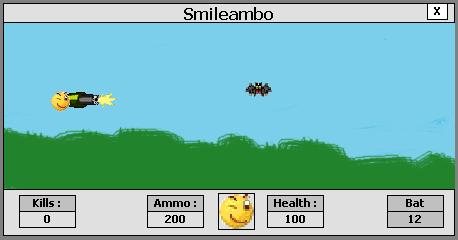



## Smileambo \- a "shoot them up" game useful source for beginers

### Description

i submited this code to help beginers and show them how to use loops and other functions to build a game
 
### More Info
 
keybord's arrow keys and space bar

basic understandin ov visual basic

character moves and shoots

             |
---                |---
**Submitted On**   |2000-03-03 00:37:46
**By**             |[JoeyJoey](https://github.com/Planet-Source-Code/PSCIndex/blob/master/ByAuthor/joeyjoey.md)
**Level**          |Intermediate
**User Rating**    |4.0 (8 globes from 2 users)
**Compatibility**  |VB 5\.0, VB 6\.0
**Category**       |[Games](https://github.com/Planet-Source-Code/PSCIndex/blob/master/ByCategory/games__1-38.md)
**World**          |[Visual Basic](https://github.com/Planet-Source-Code/PSCIndex/blob/master/ByWorld/visual-basic.md)
**Archive File**   |[Smileambo\_947926152002\.zip](https://github.com/Planet-Source-Code/joeyjoey-smileambo-a-shoot-them-up-game-useful-source-for-beginers__1-35875/archive/master.zip)

